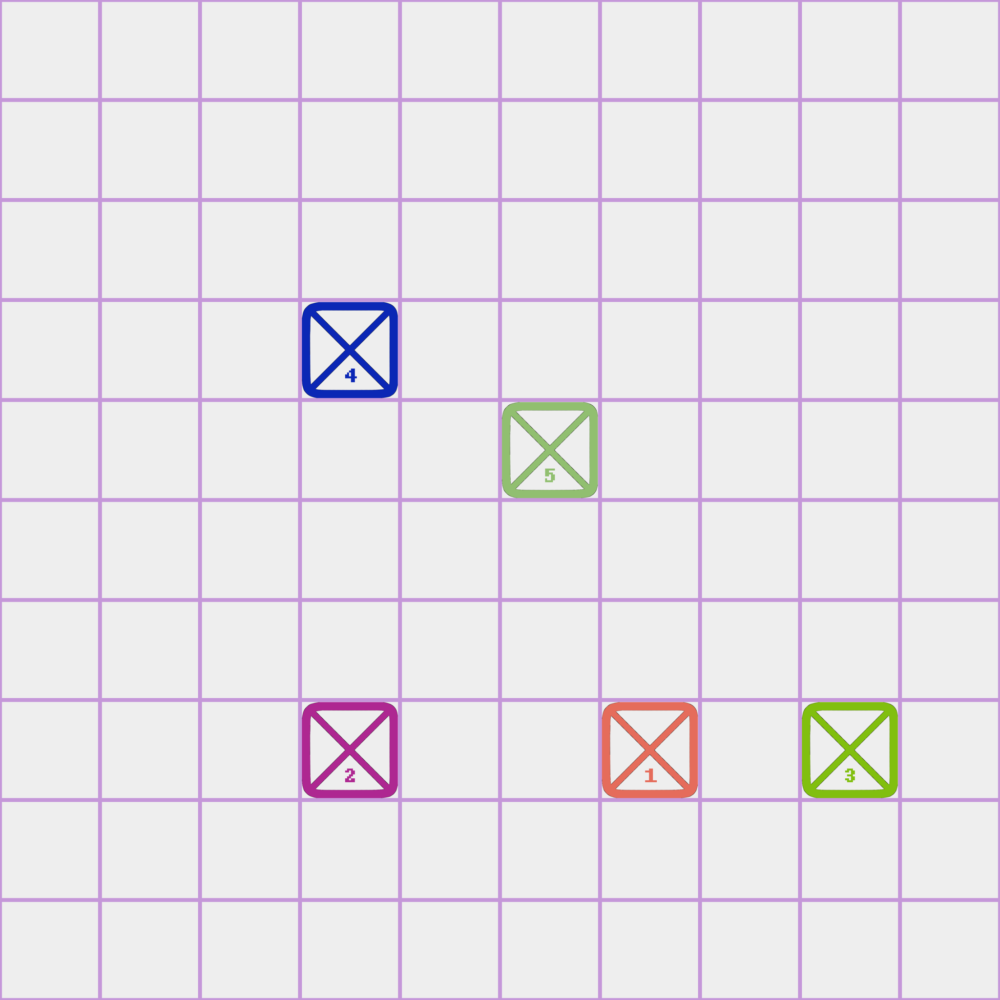

# Tanks-Robot

This is a robot for the game tanks inspired by [HalfBrick studios](https://www.halfbrick.com/).

Here is a sample of a running game with players controlling their respective tank.

## Local Compiling
In order to run a local instance of this robot, you need [Python 3.10](https://www.python.org/downloads/release/python-3100/) or [higher](https://www.python.org/downloads/).
All required libraries can be obtained with correct versioning for pip via the [requirements.txt](requirements.txt) file. If you would like to run the project and the tests, then use the [requirements_dev.txt](requirements_dev.txt) file.

The libraries referenced come with lower level libraries needed for operation and pip will automatically install those as needed.

In addition to the packages above, you will also need a discord developer token from the [discord developer portal](https://discord.com/developers/applications).
You can add the token to your `.env` file to initialize the connection with the discord servers.

## Integration Tests
All code within the robot is unit and integration tested and all tests can be run on a local machine before deployment to a [docker container](https://www.docker.com/) or [Heroku](https://www.heroku.com/).
Tests are run in GitHub actions via tox and flake8.

## Planned Features
 - Set up a game with random map (mountains, rivers, hills, etc.)
 - Different kinds of tanks with different abilities
 - Fire mechanic that makes some tiles temporarily unusable
 - Game statistics such as game duration, player who got the most/least votes, most/least aggressive, biggest trader, etc.

## Remaining Work Before Beta
 - Switch database system to postgres rather than a simple JSON file currently :heavy_check_mark:
 - Add redis caching layer for accelerated performance and query times
 - Write integration tests for multiple game dms :heavy_check_mark:
 - Unit test for handling new buttons on player cards and verifying style
 - Support for / commands
 - Tests for daily upkeep
 - Bot profile artwork
 - Win game state :heavy_check_mark:
 - Handling new game generation after a game is completed in a channel :heavy_check_mark:
 - Switch to using Ruff 1.2 for the support for Black :heavy_check_mark: